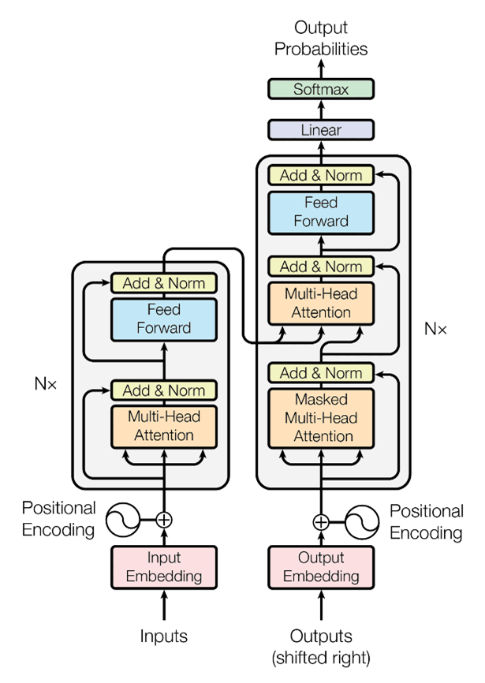
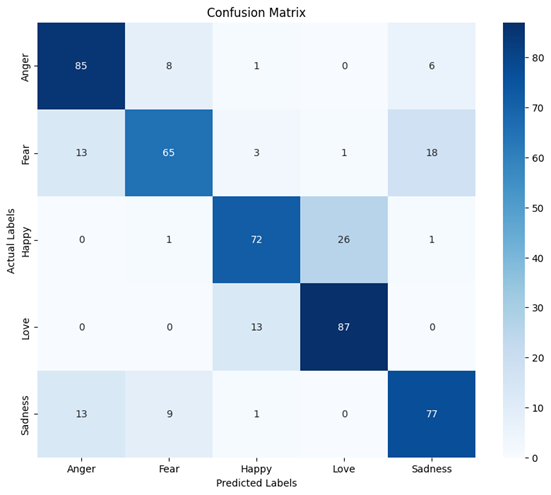

# Emotion Recognition From E-Commerce Customer Reviews Using Transformer-Based Deep Learning

## Table of Contents
- [Background](#background)
- [Project Goals](#project-goals)
- [Dataset](#dataset)
- [Technologies Used](#technologies-used)
- [Model Architecture](#model-architecture)
- [Results](#results)
  - [Accuracy and Loss Graphs](#accuracy-and-loss-graphs)
  - [Confusion Matrix](#confusion-matrix)
  - [Metrics Evaluation](#metrics-evaluation)
- [Web Application (Streamlit)](#web-application-streamlit)
  - [Single Prediction](#single-prediction)
  - [Bulk Prediction](#bulk-prediction)
- [References](#references)

## Background
In the rapidly evolving landscape of e-commerce, understanding customer emotions has become paramount for enhancing customer satisfaction and refining business strategies. Traditional methods of sentiment analysis often fall short in accurately detecting the nuanced emotions expressed in customer reviews. This project leverages the power of Transformer-based deep learning architectures to provide a sophisticated solution for emotion recognition in Indonesian-language e-commerce reviews.

## Project Goals
- Develop a robust and accurate model to classify emotions from customer reviews.
- Implement an interactive and user-friendly web application for real-time emotion detection.
- Provide actionable insights into customer sentiments to help businesses improve their strategies and customer engagement.

## Dataset

This projcet utilizes the "Product Reviews Dataset for Emotions Classification Tasks - Indonesian (PRDECT-ID) Dataset" (Sutoyo et al., 2022), published on May 20, 2022. The dataset can be accessed via this [link](https://data.mendeley.com/datasets/574v66hf2v/1). The PRDECT-ID Dataset comprises 5,400 rows and 11 columns, encompassing various product categories.

An analysis of the dataset reveals significant variation in the frequency distribution of the five emotion categories. 'Happy' is the most frequently occurring emotion, followed by 'Sadness', 'Fear', 'Love', and 'Anger'. Specifically, 'Happy' appears 1,770 times, indicating that positive experiences in e-commerce are more commonly reported or expressed in reviews. Conversely, 'Anger' has the lowest frequency, appearing only 699 times, which may suggest that customers are less inclined to express extreme dissatisfaction or that positive moments are more frequently shared. This imbalance in the dataset poses additional challenges for the model's training and evaluation.

## Technologies Used
- **Programming Languages:** Python
- **Data Processing:** Pandas, Numpy
- **Deep Learning Frameworks:** TensorFlow, Keras
- **Development and Collaboration:** Google Colaboratory
- **Web Application:** Streamlit

## Model Architecture

This project employs a Transformer-based model known for its superior performance in natural language processing tasks. The architecture includes the following components:
- **Embedding Layer:** Converts text input into dense vectors representing word embeddings.
- **Transformer Encoder:** Processes the embeddings using multi-head self-attention mechanisms to capture complex relationships within the text.
- **Fully Connected Layers:** Maps the encoder outputs to the final emotion categories.

## Results
### Accuracy and Loss Graphs

The accuracy graph shows an increasing trend during training, indicating that the model consistently improves its predictive capabilities with each epoch. However, validation accuracy fluctuates and exhibits a more moderate increase, illustrating the model's challenges in generalizing its learning to unseen data. The gap between training and validation accuracy suggests potential overfitting, although this was partially mitigated by the use of an early stopping callback.

The loss graph provides another perspective on the model's learning. The continuously decreasing training loss indicates that the model effectively minimizes prediction errors on the training data. However, the validation loss does not show a consistent decline, instead stabilizing after an initial drop. This may indicate that the model has reached its capacity to capture patterns from the validation data or may require further adjustments to its architecture or hyperparameters to improve generalization.

Overall, the results demonstrate the model's strong capability in understanding the training data but also highlight the challenges in broadly applying this learning. This underscores the importance of proper training techniques, including hyperparameter tuning, appropriate regularization, and training strategies to avoid overfitting.

### Confusion Matrix

The confusion matrix shows that the Transformer model excels in identifying 'Anger' and 'Love', but struggles with 'Fear', 'Happy', and 'Sadness'. This indicates the need for better data pre-processing and advanced feature extraction techniques to improve the model's ability to distinguish between similar emotions.

### Metrics Evaluation
The model's performance was evaluated using standard metrics such as accuracy, precision, recall, and F1-score.

The model achieves an average accuracy of 77.2%, performing best in identifying 'Love' and worst in 'Fear' and 'Happy'. The high F1-Scores across all emotions demonstrate a good balance between precision and recall. While the model performs well, there is room for improvement in recognizing nuanced emotional expressions.

## Web Application (Streamlit)
The project includes an interactive web application built using Streamlit, which allows users to perform emotion recognition in real-time.
https://text-review-emotion-recognition.streamlit.app/

### Single Prediction
Users can input a single review and obtain the predicted emotion category.

### Bulk Prediction
Users can upload a CSV or Excel file containing multiple reviews for batch processing. The application provides a downloadable sample file for reference.

<!--

## Challenges and Solutions
- **Data Imbalance:** The dataset had an uneven distribution of emotion categories. This was addressed by using class weights during training and applying data augmentation techniques to generate more samples for the minority classes.
- **Complexity of Transformer Models:** Transformer models are computationally intensive and require significant resources for training. We utilized transfer learning and fine-tuning to leverage pre-trained models, which reduced training time and improved performance.

## Future Work
There are several potential improvements and future directions for this project:
- **Expanding the Dataset:** Increasing the size and diversity of the dataset to improve model generalization.
- **Advanced Transformer Architectures:** Exploring more advanced architectures such as BERT, GPT, or T5 for potentially better performance.
- **Multi-lingual Support:** Extending the model to support multiple languages for broader applicability.
- **Real-time Deployment:** Implementing the model in a real-time production environment with API support for integration with other systems.
-->
## References
- Sutoyo, R., Chowanda, A., Achmad, S., Andangsari, E. W., M. Isa, S., Soetandar, J. P., . . . Pirdaus, F. P. (2022). Product Reviews Dataset for Emotions Classification Tasks - Indonesian (PRDECT-ID) Dataset. 
- Vaswani, A., Shazeer, N., Parmar, N., Uszkoreit, J., Jones, L., Gomez, A. N., Kaiser, Ł., & Polosukhin, I. (2017). Attention is all you need. Advances in Neural Information Processing Systems, 2017-Decem(Nips), 5999–6009.
- https://keras.io/examples/nlp/text_classification_with_transformer/
